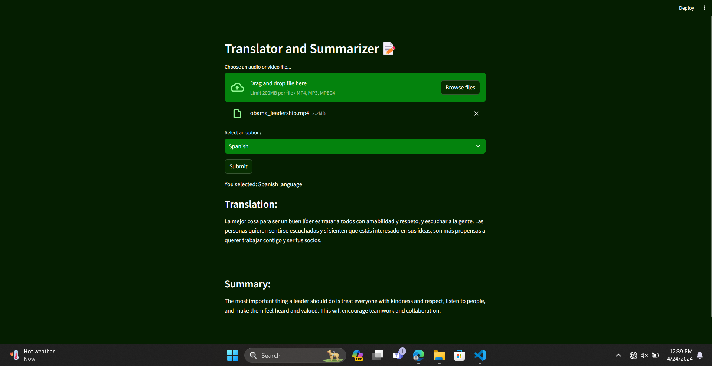

# Translator and Summarizer

🤖 **Welcome to the Translator and Summarizer project!** This project takes in a audio or video file as an input and converts it into text, translates it into one of 3 languages and summarizes it.


## Usage
1. Run `requirements.txt` to install the dependencies.

```bash
pip install -r requirements.txt
```
2. Execute `translator_and_summarizer.py` to open up the UI using the following command:

```bash
streamlit run translator_and_summarizer.py
```

